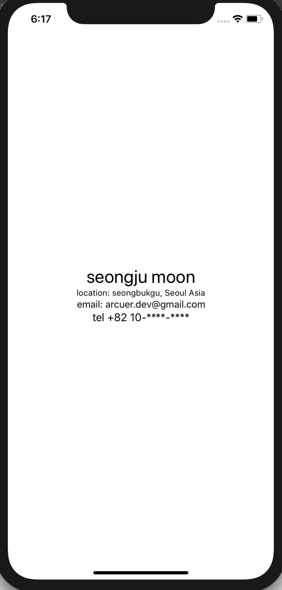

# swiftui-tutorials

이 레포지토리는 apple WWDC19에서 발표된 swiftui를 학습하기 위한 레포입니다

## 요구사항 (requirments)
  - xcode11 (beta)
  - macOS Catalina (Beta)

## 참고한 다른 부분 (references)
   - https://developer.apple.com/tutorials/swiftui/creating-and-combining-views

## 화면 

